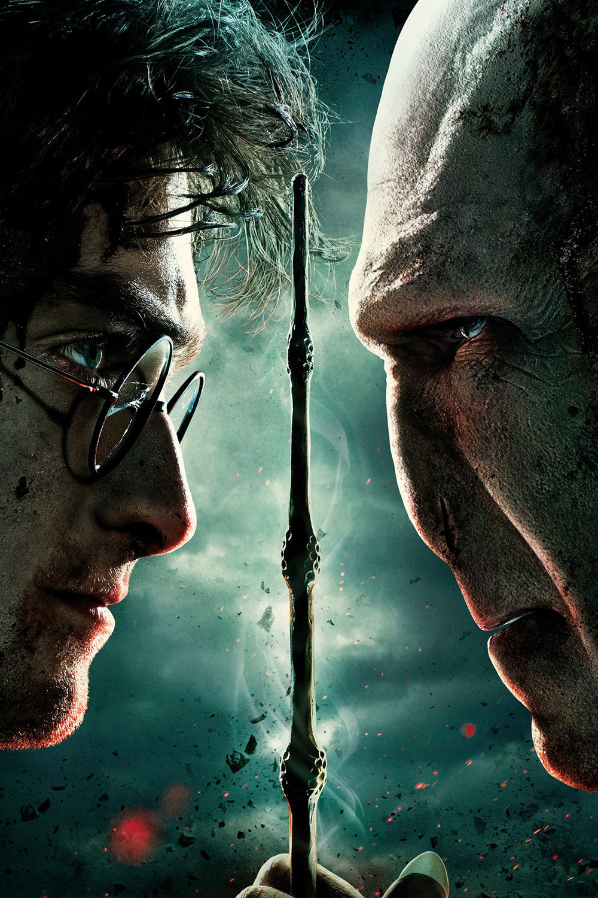

<h1 align="center">Der Magische Kampf</h1>
<h2 align="center"> RPG Spiel</h2>
<h3 align="center"> Abschlussaufagbe Marco Grimme</h3>
 

  

## Willkommen zu deinem Zauberer-Battle-Spiel, wo du ein Team von tapferen Zauberern gegen die finsteren Mächte von Lord Voldemort und Nagini führst. Mache dich bereit für aufregende Kämpfe und taktische Entscheidungen in der magischen Welt!

# 1. Teams

* Du kontrollierst ein Team von Zauberern, bestehend aus Harry Potter, Ron Wesley und Albus Dumbledore. Diese sind in einer Liste namens "helden" gespeichert. Die dunklen Zauberer, angeführt von Lord Voldemort und Nagini, sind in der Liste "gegner" gespeichert.

## 2. Spielrunden

* Das Spiel wird in Runden gespielt. Jeder Zauberer in deinem Team führt in jeder Runde einen Angriff aus. Lord Voldemort und Nagini greifen ebenfalls an, solange die Gegner am Leben sind.

## 3.Spielverlauf
* Die Konsole gibt Informationen über Lebenspunkte und Angriffe der Zauberer aus. Wenn Lord Voldemort besiegt ist, ruft er Nagini zur Hilfe. Wird Nagini besiegt, endet das Spiel. Besondere Ereignisse: Lord Voldemort ruft Nagini zur Hilfe, Nagini führt Bonusattacken aus, und die Zauberer haben spezielle Angriffe.

## 4.Sieg oder Niderlage
* Das Spiel endet, wenn entweder alle Zauberer in deinem Team oder alle dunklen Zauberer besiegt sind.

## 5. Spezialfunktionen

* Zauberer haben die Möglichkeit, Heiltränke und magische Elixiere zu verwenden, um ihre Überlebenschancen zu erhöhen.
Spezialattacken können nur unter bestimmten Bedingungen ausgeführt werden und verleihen dem Spiel eine zusätzliche taktische Dimension
Zauberer haben die Fähigkeit, sich von Naginis Gift zu erholen und erhalten permanente Heilung durch magische Elixiere.

## 6. Zusatzaufgabe

* Lord Voldemort ruft Nagini, wenn seine Lebenspunkte auf 0 fallen. Nagini führt Bonusattacken aus, und die Zauberer müssen geschickt reagieren
und müssen auch Nagini besiegen
## 7. Spielende
* Das Spiel endet mit einer Siegesnachricht, wenn entweder dein Team oder die dunklen Zauberer gewonnen haben.
Die Konsole gibt abschließend die Siegermannschaft aus.

## Viel Spaß beim Spielen und möge die Magie mit dir sein!